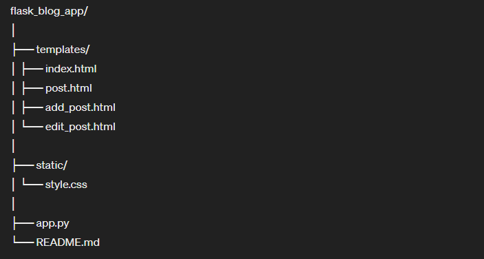

# Flask Blog Web Application

## Overview
This is a simple blog web application built using Flask, where users can create, read, update, and delete blog posts.

## Features
- View all blog posts on the home page.
- View individual blog posts with details.
- Add new blog posts.
- Edit existing blog posts.
- Delete blog posts.

## Requirements
- Python 3.x
- Flask
- Basic understanding of HTML, CSS, and Python

## Setup
1. Clone this repository to your local machine.
2. Install the required dependencies using `pip install -r requirements.txt`.
3. Run the Flask application using `python app.py`.
4. Access the application in your web browser at `http://localhost:5000`.

## Project Structure

## Usage
- Navigate to the home page to view all blog posts. 
- Click on a blog post to view its details.
- Click on "Add New Post" to create a new blog post.
- Click on "Edit" next to a post to edit it.
- Click on "Delete" next to a post to delete it.
